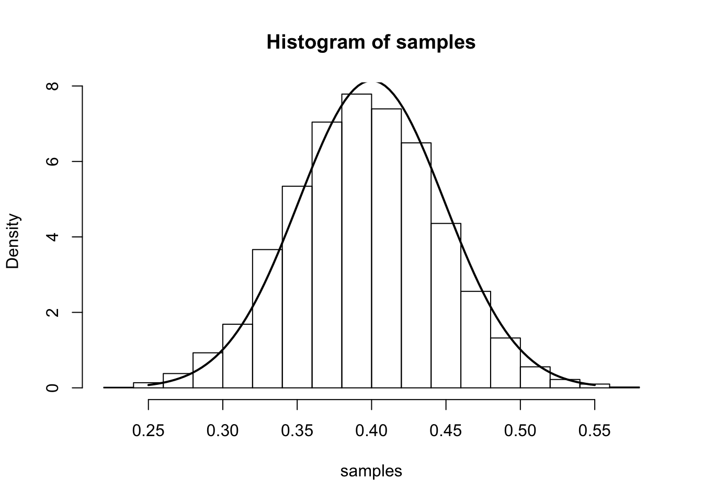

# Asymptotic Normality of MLE
Matt Bonakdarpour  


## Main Result
Maximum likelihood is a popular method for estimating parameters in a statistical model. Assume we observe i.i.d. samples $X_1,\ldots,X_n$ with probability distribution governed by the parameter $\theta$. Let $\theta_0$ be the true value of $\theta$, and $\hat{\theta}$ be the maximum likelihood estimate (MLE). Under regularity conditions, the MLE for $\theta$ is asympototically normal with mean $\theta_0$ and variance $I^{-1}(\theta_0)$. $I(\theta_0)$ is called the **Fisher information** -- we will describe it below. Precisely, this result states that:
$$\sqrt{n}(\hat{\theta} - \theta_0) \rightarrow N(0,I^{-1}(\theta_0))$$

If $\hat{\theta}$ is the MLE, then this says that $(\hat{\theta} - \theta_0)/I^{-1}(\theta_0)$ is nearly $N(0,1)$ when the sample size $n$ is large. This allows us to construct approximate confidence intervals for $\theta$ and perform hypothesis tests. 

### Fisher Information
First, some notation:  
* **Likelihood**: $L(\theta) = p(X_1,\ldots,X_n;\theta)$  
* **Log-likelihood**: $\ell(\theta) = \log{L(\theta)}$  
* **Score function**: $s(\theta) = \frac{d}{d\theta}\ell(\theta)$

The MLE $\hat{\theta}$ maximizes both $L(\theta)$ and $\ell(\theta)$. We typically find $\hat{\theta}$ by differentiation, solving the following equation for $\theta$:  
$$s(\theta) = 0$$  

Under regularity conditions, the Fisher information, $I(\theta)$, is :
$$I(\theta) = E_{\theta}\left[-\frac{d^2}{d\theta^2}\ell(\theta)\right]$$

Intuitively, this quantity tells us, on average, how peaked the likelihood function is. The more peaked the likelihood function, the "better" we know the true parameter. In this way, this quantity provides *information* about the true parameter. 

## Example 1: Bernoulli Proportion
Assume we observe i.i.d. samples $X_1,\ldots,X_n$ drawn from a Bernoulli distribution with true parameter $p_0$. Given, these observations, the log-likelihood is:
$$\ell(p) = \sum X_i\log{p} + (1-X_i)\log(1-p)$$
Setting the derivative equal to zero, we obtain:  
$$\frac{d}{dp}\ell(p) = \sum \frac{X_i}{p} - \frac{(1-X_i)}{1-p} = 0$$  
Solving for $p$, we get that the MLE is the sample mean: $\hat{p} = \bar{X}$.

The second derivative with respect to p is:  
$$\frac{d^2}{dp^2} \ell(p) = \sum -\frac{X_i}{p^2} - \frac{(1-X_i)}{(1-p)^2}$$

The Fisher information is therefore:
$$I(p) = E\left[-\frac{d^2}{dp^2}\ell(p)\right] = -\frac{E[X_i]}{p^2} - \frac{(1-E[X_i])}{(1-p)^2} = \frac{1}{p(1-p)}$$

From the result at the top of the page, we have that (for large n), $\hat{p}$ is approximately $N\left(p,\frac{p(1-p)}{n}\right)$. We illustrate this approximation in the simulation below. 

The simulation creates 7000 different sets of samples. In each sample, we have 100 draws from a Bernoulli distribution with true parameter equal to 0.4. We compute the MLE separately for each sample and plot a histogram of these 7000 MLEs. On top of this histogram, we plot the density of the asymptotic distribution as a solid line. 


```r
num.iterations         <- 7000
p.truth                <- 0.4
num.samples.per.iter   <- 100
samples                <- numeric(num.iterations)
for(iter in seq_len(num.iterations)) {
  samples[iter] <- mean(rbinom(num.samples.per.iter, 1, p.truth))
}
hist(samples, freq=F)
curve(dnorm(x, mean=p.truth,sd=sqrt((p.truth*(1-p.truth)/num.samples.per.iter) )), .25, .55, lwd=2, xlab = "", ylab = "", add = T)
```

 

##Example 2: Poisson Mean 
Assume we observe i.i.d. samples $X_1,\ldots,X_n$ drawn from a Poisson distribution with true parameter $\lambda$. The log-likelihood is: 

$$ \ell(\lambda; X_1,\ldots,X_n) = \sum_{i=1}^n -\lambda + X_i\log(\lambda) + \log(X_i!)$$

Taking the derivative with respect to $\lambda$, setting it equal to zero, and solving for $\lambda$ gives us the estimate $\hat{lambda} = \frac{1}{n}\sum_{i=1}^{n}X_i = \bar{X}$. The Fisher information is: 

$$ E_{\lambda}\left[-\frac{d^2}{d\lambda^2}\ell(\lambda)\right] = E[\frac{X}{\lambda^2}] = \frac{1}{\lambda}$$

So we have that, we have that (for large n), $\hat{\lambda}$ is approximately $N\left(\lambda,\frac{1}{n\lambda}\right)$. We illustrate this in the same was as above:


```r
num.iterations         <- 7000
lambda.truth           <- 0.8
num.samples.per.iter   <- 100
samples                <- numeric(num.iterations)
for(iter in seq_len(num.iterations)) {
  samples[iter] <- mean(rpois(num.samples.per.iter, lambda.truth))
}
hist(samples, freq=F)
curve(dnorm(x, mean=lambda.truth,sd=sqrt(lambda.truth/num.samples.per.iter) ), 0.4, 1.2, lwd=2, xlab = "", ylab = "", add = T)
```

 

